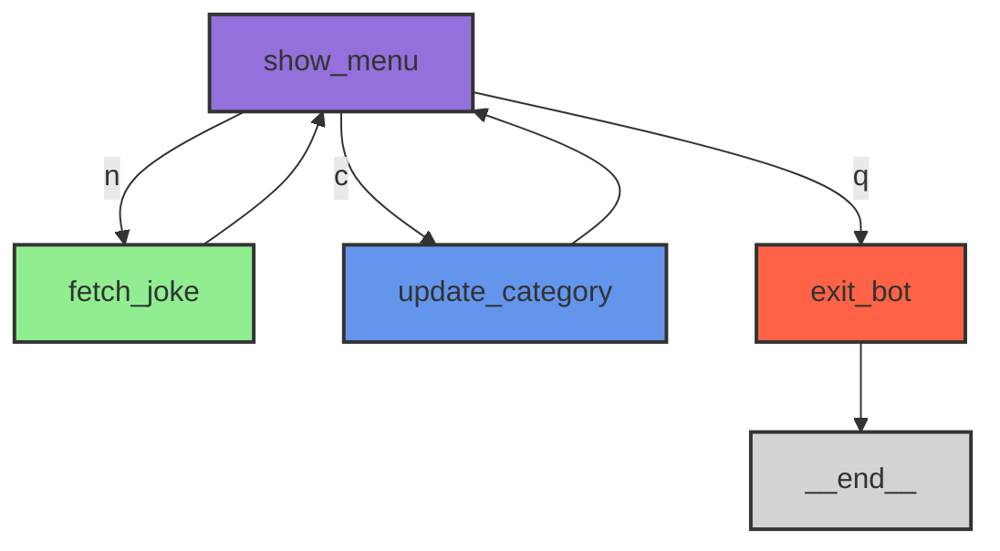

# ジョークボット ワークフローダイアグラム

以下のMermaidコードは、ジョークボットのワークフローを視覚的に表現しています。このコードをMermaid対応のツールやウェブサイト（例：[Mermaid Live Editor](https://mermaid.live/)）に貼り付けることで、ダイアグラムを生成できます。

## ダイアグラムの説明

このワークフローは以下の4つのノードで構成されています：

1. **show_menu** (紫色)：
   - メインのコントロールノード
   - ユーザーに3つの選択肢を提示：
     - 次のジョークを聞く (n)
     - ジョークのカテゴリを変更する (c)
     - アプリを終了する (q)
   - ユーザーの入力に基づいて、次のノードにルーティングします

2. **fetch_joke** (緑色)：
   - 選択されたカテゴリからジョークを取得して表示
   - ジョークを表示した後、show_menuに戻ります

3. **update_category** (青色)：
   - ユーザーが新しいジョークカテゴリを選択できるようにします
   - カテゴリ更新後、show_menuに戻ります

4. **exit_bot** (赤色)：
   - ユーザーが終了を選択した場合、さようならを言ってグラフを終了
   - 特別な__end__ノードにルーティングします

このシステムは、ユーザーが明示的に終了を選択するまでループします。